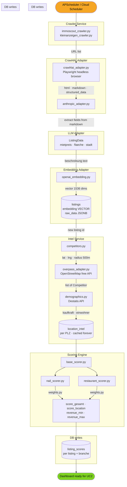
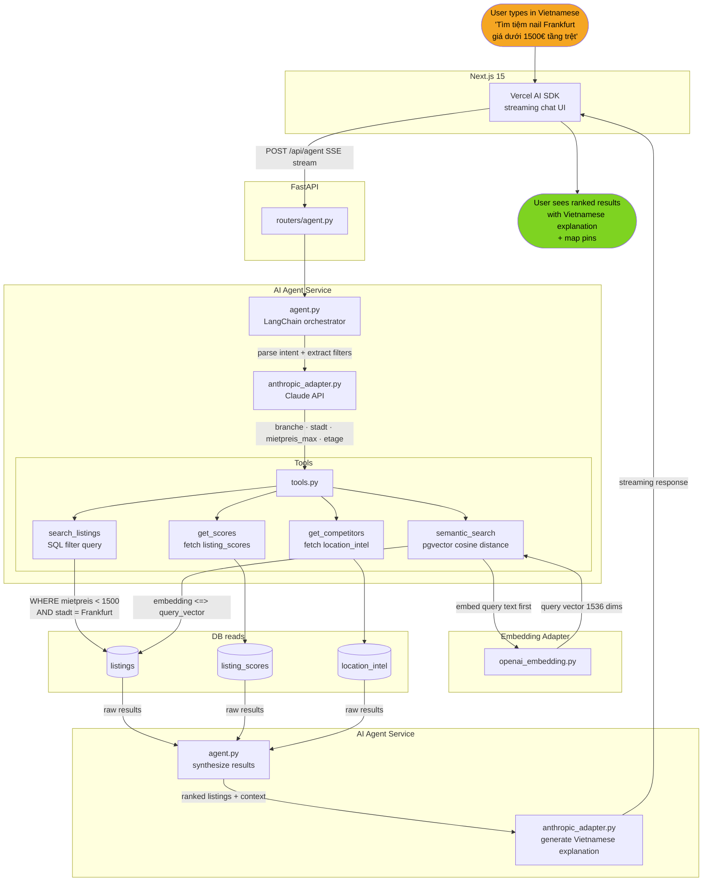

# Use Cases & Technology Map

## Overview

immo-ai has two core use cases that are **tightly coupled** — UC1 is the data
producer that runs continuously in the background, while UC2 is the consumer
that answers user queries in real time. UC2 is only as good as the data UC1 has
collected.

```
UC1 (Crawler Pipeline)  ──feeds──►  PostgreSQL  ◄──reads──  UC2 (AI Search)
```

---

## UC1 – Market Intelligence Pipeline

A scheduled background pipeline that continuously crawls German commercial real
estate platforms, enriches each listing with location intelligence, scores it
per business type, and stores everything in the database.

**Trigger:** APScheduler every 6 hours (Phase 1–2) → Cloud Scheduler (Phase 3)

**Actor:** No human interaction required. Runs autonomously.



---

## UC2 – AI Search Assistant

A real-time query flow triggered by a user typing in Vietnamese. The AI agent
parses intent, calls internal tools backed by the database UC1 has populated,
and returns a ranked, explained result in Vietnamese.

**Trigger:** User submits a query in the Next.js chat interface.

**Actor:** End user (Vietnamese business owner in Germany).



---

## Relationship Between UC1 and UC2

UC1 and UC2 share the same database and adapter layer. They never call each
other directly — PostgreSQL is the contract between them.

```
┌─────────────────────────────────────────────────────────────────────┐
│                         Shared Layer                                │
│                                                                     │
│   adapters/llm/anthropic_adapter.py   ← used by BOTH UC1 and UC2   │
│   adapters/embeddings/openai_embedding.py  ← used by BOTH          │
│   adapters/maps/overpass_adapter.py   ← UC1 only                   │
│   adapters/crawlers/crawl4ai_adapter.py  ← UC1 only                │
│                                                                     │
│   PostgreSQL                                                        │
│   ├── listings          ← UC1 writes  │  UC2 reads                 │
│   ├── location_intel    ← UC1 writes  │  UC2 reads                 │
│   └── listing_scores    ← UC1 writes  │  UC2 reads                 │
└─────────────────────────────────────────────────────────────────────┘
```

| Dimension | UC1 | UC2 |
|---|---|---|
| Trigger | Time-based (every 6h) | User-based (on demand) |
| Direction | Writes to DB | Reads from DB |
| Latency | Minutes per run | Seconds per query |
| LLM usage | Extract structured data from HTML | Generate Vietnamese answers |
| Embedding | Embed listing descriptions | Embed user query |
| Maps | Fetch competitor data | Display results on map |
| Dependency | Independent | Depends on UC1 having run |

**Quality relationship:** UC2 answer quality improves directly with UC1 data
quality. A freshly initialized database with no listings returns no results. A
database with 3 months of crawled and scored listings returns highly relevant,
ranked, explained results.

---

## Technology Map

| Technology | UC1 | UC2 | Why |
|---|---|---|---|
| **Crawl4AI** | ✅ crawl listings | — | AI-assisted HTML extraction, no manual parser |
| **Playwright** | ✅ fallback browser | — | JS-rendered pages, login sessions |
| **httpx** | ✅ simple requests | — | Static pages, faster than browser |
| **APScheduler** | ✅ trigger every 6h | — | Run pipeline without user |
| **LangChain** | — | ✅ agent orchestration | Tool calling, multi-step reasoning |
| **Claude API** | ✅ extract fields from markdown | ✅ answer in Vietnamese | Best multilingual understanding |
| **OpenAI Embeddings** | ✅ embed descriptions | ✅ embed user query | Same model → compatible vectors |
| **pgvector** | ✅ store vectors | ✅ cosine search | One DB for everything |
| **PostGIS** | ✅ store coordinates | ✅ map display | Geo queries in SQL |
| **Overpass API** | ✅ fetch competitors | — | Free, OSM-based, accurate in DE |
| **Destatis API** | ✅ demographics per PLZ | — | Official DE statistics, free |
| **Redis** | ✅ job queue (arq) | ✅ cache hot queries | Avoid repeat API calls |
| **FastAPI** | — | ✅ REST + SSE endpoints | Async, auto docs |
| **Next.js 15** | — | ✅ chat UI + map | SSE streaming, Server Components |
| **Mapbox GL JS** | — | ✅ map rendering | Free 50k loads/month, customizable |
| **Vercel AI SDK** | — | ✅ streaming chat | Native SSE, works with any LLM |
